# Smart Pixel Display

[](https://www.python.org/)
[](https://pypi.org/project/pypixelcolor/)
[](https://github.com/posch-dev/smart-pixel-display/releases)
[](LICENSE)

An intelligent display controller for a 128x32 iPixel Bluetooth Display.

Four panels take turns on the display, picked Automatically; By time of day, whether music is
playing, and what is on your calendar. You can also switch to panels manually.

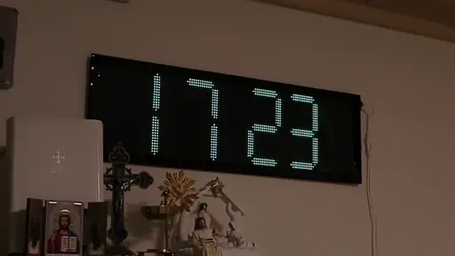

## Features

**Four panels**

| |                                                                               |
|---|-------------------------------------------------------------------------------|
| **Clock** | 24h digital clock                                                             |
| **Now Playing** | cover art, track info and a beat visualizer for whatever you are listening to |
| **Verse of the Day** | A daily bible verse, a few times a day                                        |
| **Dashboard** | Live weather and calendar events with a departure countdown                   |

- Intelligent cycling for panels

**Other features**

- **Web application:** Control the display, watch it live and change settings
- **The Twin:** a looksmaxxed live preview of the display in your browser
- **Twin Viewer & Editor:**
  - **Full Screen Viewer:** View "The Twin" in Full Screen
  - **Editor:** Customize everything about the pretty live preview of your Display (a.k.a "The Twin")
  - **Export**: Download the preview as a Photo or animation. perfect for Social media AYO diese zeile verfeinern bitte
- **Ready made iPhone shortcuts:** push your calendar to the Dashboard automatically
- **Webhooks** Fire Webhooks automatically based on events on the Display, perfect for smart application like WLED Ayo hier verfeinern und Wled hyperlink bitte
- REST API for everything else

## Hardware

| Item | Required features | Example                                                                                                                                         |
|---|---|-------------------------------------------------------------------------------------------------------------------------------------------------|
| Display | 128x32 RGB LED matrix, BLE, [pypixelcolor](https://pypi.org/project/pypixelcolor/) protocol | 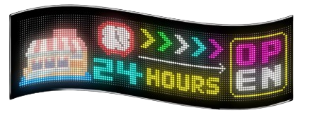<br>[iPixel 128x32 LED Matrix](https://de.aliexpress.com/item/1005009054780561.html) |
| Controller | Python 3, Bluetooth | 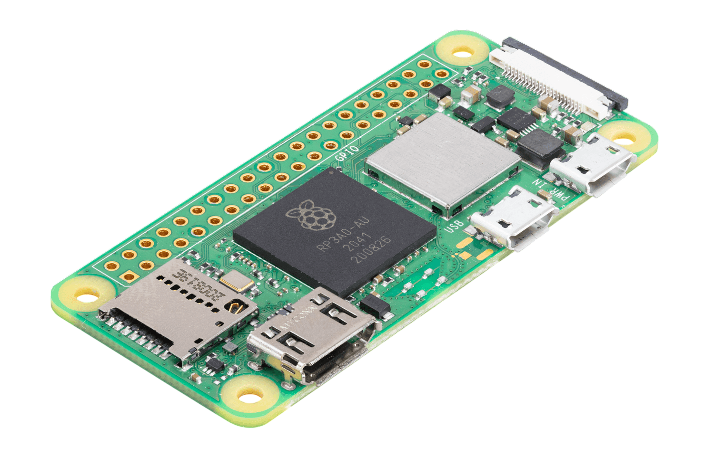<br>[Raspberry Pi Zero 2 W](https://www.raspberrypi.com/products/raspberry-pi-zero-2-w/)  |

Anything that runs Python and has Bluetooth works as the controller, a laptop or an old
mini PC works too.

##### --> [Jump to Setup](#setup)

## Panels

The Automatic scheduler switches the panel on its own,
but you can always switch through panels manually.

| Panel | What it shows                                                              | |
|---|----------------------------------------------------------------------------|---|
| [Clock](panels/clock/README.md) | 24h digital clock                                                          | 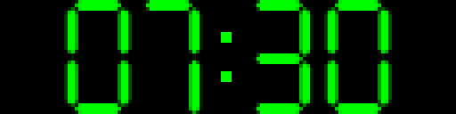 |
| [Verse of Day](panels/verse_of_day/README.md) | daily bible verse                                                          |  |
| [Now Playing](panels/now_playing/README.md)\* | Your currently played song with cover art, BPM Visualizer and progress bar | 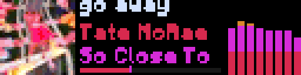 |
| [Dashboard](panels/dashboard/README.md) | live weather and calendar events with travel countdowns                    |  |

\*Now Playing needs free API keys. See how to get them [here](panels/now_playing/README.md).

## Web Application

The web app is available on port 12832, so it is reachable from any phone or laptop
in the network at `http://<device-ip>:12832`.

| Desktop                                                        | Mobile                                                        |
|----------------------------------------------------------------|---------------------------------------------------------------|
| 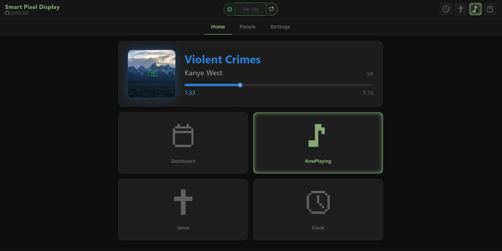 | 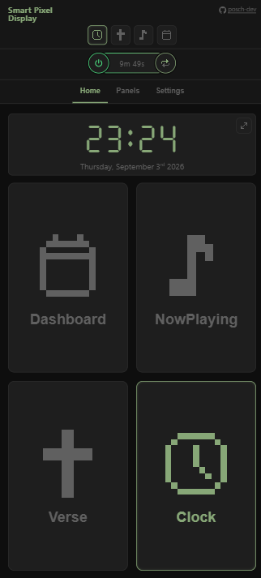 |

It serves as the remote control of the display:
- power on/off
- brightness
- switch panels
- live preview (with Viewer & Editor)
- Settings

When an Update is available, the web app notifies and offers to install it.

## The Twin

The Twin is the looksmaxxed browser preview for the display.
It sits on the Home tab of the Web App and follows whatever the real Display displays.


"The Twin" has two color modes:

| Color Mode: Web                                                     | Color Mode: Pixel                                                                                                  |
|---------------------------------------------------------------------|--------------------------------------------------------------------------------------------------------------------|
| 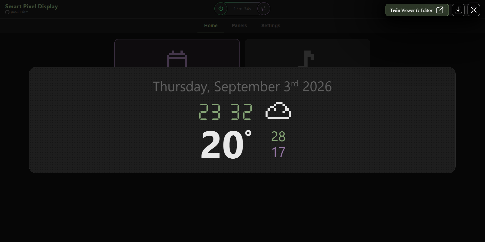<br>sleek and modern visualization of your display | 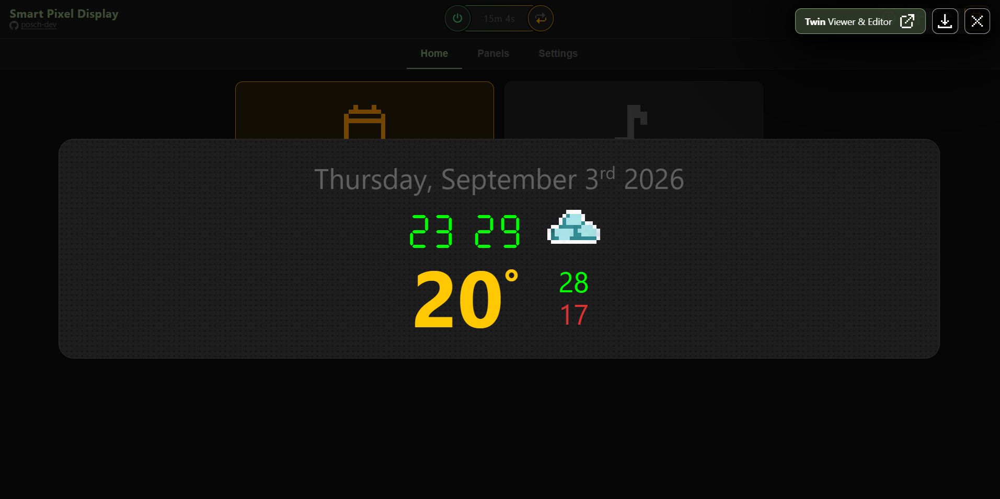<br>HD Version of your Display in accurate colors |

Color Modes are switchable per panel or globally


You can also View it in big on the Home Screen of the Web App 
(like the examples you see above).
From there you can even export a Screenshot or an Animation  
or step over into the [Twin Viewer & Editor](#twin-viewer--editor)
that offers more customization and export settings.

If you do not want "The Twin" on the Home tab,
you can disable it in the Settings tab of the Web Application.

## Twin Viewer & Editor

The Twin on a page of its own, made for a big screen like a second monitor.

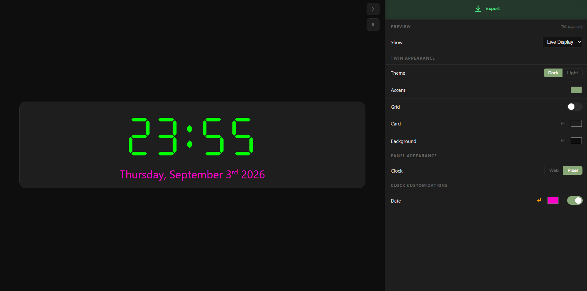

You get there by enlarging the Twin on the Home tab, or
from *Settings -> Web -> Twin Viewer & Editor*, or straight at `/preview`.

- **Fullscreen**: nothing but the panel, as big as the screen allows
- **Preview**: follow the live display or choose a specific panel
- **Full customization**: Customize the Color or Hide any element on a Panel.
- **Export:** Save Screenshots or Animations of "The Twin" in various formats in up to 4K Resolution. Perfect for social media!

**Export Example:**


Supported Export Formats:
- PNG
- SVG
- MP4
- GIF
- WebM
- Animated SVG

## Setup

**Prerequisites:** Python 3.11+, Bluetooth. On Linux also `python3-venv`.

### 1. Clone and install

```bash

# Linux
git clone https://github.com/posch-dev/smart-pixel-display.git
cd smart-pixel-display
./install.sh

# ==== OR ===== #

# Windows
git clone https://github.com/posch-dev/smart-pixel-display.git
cd smart-pixel-display
powershell -ExecutionPolicy Bypass -File install.ps1
```

The installer builds the `.venv`, installs the dependencies and then walks you through it:

1. **Display**: Scans BLE Devices and lists what it finds.
2. **Panels**: asks which panels to turn on
3. **Autostart**: a systemd unit on Linux, a scheduled task on Windows. Say no and it
   prints the start command instead.

Then it starts the service and prints the URL of the Web App.

An existing `config.toml` or `.env` is never overwritten. Run the installer again to fill
in what is missing, or `--reconfigure` to answer everything anew.

| Flags for the install script | What it does |
|---|---|
| `--yes`, `-y` | take every default, ask nothing |
| `--reconfigure` | ask again even though the config is already there |
| `--autostart` / `--no-autostart` | decide autostart without being asked |
| `--update` | pull the latest release and restart |
| `--check-update` | check for updates |
| `--fresh` | update the `.venv` |
| `--help` | this list |

### 2. API keys

Only the "Now Playing" Panel needs API keys, the other three panels run without any.
**All keys are free.** The installer asks for them,
and you can always put them into `.env` yourself:

```env
# Last.fm
LASTFM_API_KEY=your_lastfm_key
LASTFM_SECRET=your_lastfm_secret
LASTFM_USERNAME=your_lastfm_username

# ==== AND/OR ===== #

# Libre.fm
LIBREFM_USERNAME=your_librefm_username
LIBREFM_PASSWORD=your_librefm_password
```

For accurate BPM visualization on the BPM Visualizer add:
```env
# (Optional, but recommended)
GETSONGBPM_API_KEY=your_getsongbpm_key
```


### 3. Running

With autostart on Linux:

```bash
sudo systemctl start smartpixeldisplay      # Start
sudo systemctl status smartpixeldisplay     # Check status
sudo systemctl restart smartpixeldisplay    # Restart
sudo systemctl stop smartpixeldisplay       # Stop
journalctl -u smartpixeldisplay -f          # Live logs
```

By hand:

```bash
./.venv/bin/python startup.py
```

You can also run a single panel standalone, from the repo directory, so it finds
the dependencies in the `.venv`:

```bash
./.venv/bin/python panels/<panel>/main.py
```

No display yet? Every panel runs in the browser instead, see [Flags](#flags).

### 4. Updating

The service checks GitHub for a new release once a day, and the web app shows a notice
when there is one. To install it:

```bash
./install.sh --check-update  # check for updates
./install.sh --update        # install update
```

## Configuration

Everything is reachable from the web application, that is the comfortable way to change settings. The
changes from the Web Application or the API land on disk immediately in `config.toml`.

>A handful of settings live in `[expert]` and only change by editing the file. Those are dev
>and expert settings, you do not need them for normal use.

Each panel supports webhooks that fire HTTP requests on `on_enter` and `on_exit`.
Device level webhooks fire on power on/off and active hours start/end.

Now Playing also supports `on_song_change`, which fires when a new song is displayed.
It has template variables for colors and track info
 
| Accent Colors        | Track Infos  |
|----------------------|--------------|
| `{{accent1_hex}}`    | `{{title}}`  |
| `{{accent1_rgb}}`    | `{{artist}}` |
| `{{accent1_full_r}}`  | `{{album}}`  |
| full brightness color variants for external devices like WLED. | etc.         |
| etc.     |              |


## Flags

`--visualize` runs a panel in your browser instead of on the display, and walks it through
every state it can draw. The frames are the real ones, drawn by the same code the display
gets. Leave the tab open, it adopts the next run by itself.

```bash
./.venv/bin/python startup.py --visualize            # every panel, every state
./.venv/bin/python startup.py --visualize --live     # real data, panels switching on their own
```

| Flag | Where | Term | Web¹ | Browser | Display | What it does |
|---|---|:-:|:-:|:-:|:-:|---|
| *(none)* | all | ✓ | ✓ | ✗ | ✓ | the normal run |
| `--visualize` | all | ✓ | ✓ | ✓ | ✗ | serve the frames at `http://localhost:12833`, open a tab, walk the canned states |
| `--live` | all | ✓ | ✓ | ✓ | ✗ | real data and the API instead of the walk |
| `--offline` | all | ✓ | ✓ | ✓ | ✗ | no outgoing API calls at all, not even cover art |
| `--no-browser` | all | ✓ | ✓ | ✓ | ✗ | serve the page but open no tab |
| `--debug` | `startup.py` | ✓ | ✓ | ✗ | ✓ | verbose log, same as `debug_log` in `[expert]` |
| `--scan` | `startup.py` | ✓ | ✗ | ✗ | ✗ | list nearby Bluetooth devices |
| `--clear-slots` | `startup.py` | ✓ | ✗ | ✗ | ✓² | wipe every image slot on the display |
| `--poll-debug` | `startup.py`, Now Playing | ✓ | ✗ | ✗ | ✗ | dump what the scrobbler reports about the current track |
| `--font-preview` | `startup.py` | ✓ | ✗ | ✗ | ✗ | one Now Playing GIF per font, into `assets/fonts/previews` |
| `--lat`, `--lon` | Dashboard | ✓ | ✓ | ✗ | ✓ | override the weather location for this run |

¹ `startup.py` only, not on standalone panels.  
² communicates with display but renders no output

`--live`, `--offline` and `--no-browser` are modifiers, their ticks show the `--visualize` run
they belong to. The visualize port is `visualize_port` in `[expert]`. Without a `config.toml`
the panels read `config.example.toml`, so a fresh checkout runs as it is.

## REST API

```
GET    /status                 - active mode, connected state, clearing status
POST   /display/power          - turn display on/off: {"on": true/false}
GET    /mode                   - current mode, triggers, display state
POST   /mode/trigger/{name}    - trigger a panel: clock | verse_of_day | nowplaying | dashboard
DELETE /mode/{name}            - untrigger a panel (returns to scheduler)
POST   /mode/reset             - clear all manual triggers, hand back to auto-scheduler
POST   /calendar               - push a calendar event to the dashboard
GET    /calendar               - list all calendar events
DELETE /calendar               - clear all calendar events
POST   /dashboard/trigger      - manually trigger dashboard
GET    /dashboard/status       - current dashboard data (weather + calendar)
GET    /config                 - full config dump
POST   /config/{section}/{key} - update a config value: {"value": ...}
```

### Smartphone Shortcuts

Ready made iPhone shortcuts that talk to this API live in
[posch-dev/apple-shortcuts](https://github.com/posch-dev/apple-shortcuts):

| Icon                                                                                                                                                              | Shortcut                                                                                                        | What it does |
|-------------------------------------------------------------------------------------------------------------------------------------------------------------------|-----------------------------------------------------------------------------------------------------------------|---|
|  | [Calendar to Dashboard](https://github.com/posch-dev/apple-shortcuts/tree/main/shortcuts/calendar-to-dashboard) | Pushes today's events to `POST /calendar`, driving time included |
|      | [Morning Dashboard](https://github.com/posch-dev/apple-shortcuts/tree/main/shortcuts/morning-dashboard)         | Runs the above from your alarm, only when you are at home                                                       |

## License

GPL-3.0, see [here](./LICENSE).

Icons come from two sets: [pixelarticons](https://github.com/halfmage/pixelarticons) under
MIT, and Streamline Pixel by [Streamline](https://streamlinehq.com) under
[CC BY 4.0](https://creativecommons.org/licenses/by/4.0/).

The web UI asks for Segoe UI and falls back to [Selawik](https://github.com/microsoft/Selawik),
Microsoft's open source replacement for it, under the
[SIL Open Font License 1.1](https://scripts.sil.org/OFL). The licence ships with the font in
`assets/fonts/Selawik-LICENSE.txt`.
