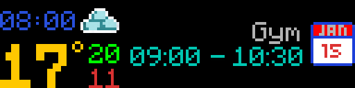
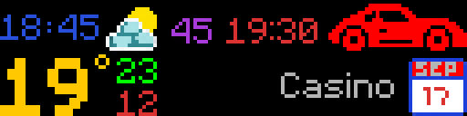
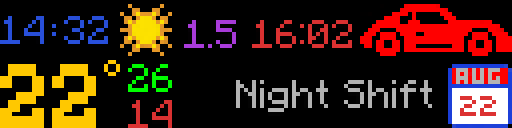
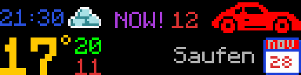

# Dashboard

[Back to README](../../README.md) | [Previous: Verse of Day](../verse_of_day/README.md) | [Next: Now Playing](../now_playing/README.md)

Clock, live weather, and upcoming calendar events with travel-time warnings on one screen.


# Legend

| Element | What it shows |
|---|---|
| <!-- png --> | blue numbers, the current time |
| <!-- png --> | yellow number, the temperature right now |
| <!-- png --> | green number, today's high |
| <!-- png --> | red number, today's low |
| <!-- png --> | weather icon, what the sky is doing right now, cloudy, overcast, rain and so on |
| <!-- png --> | calendar icon with today's month and day rendered into it |
| <!-- png --> | turquoise text, the timespan of the event |
| <!-- png --> | grey text, the name of the event |
| <!-- png --> | car icon, marks the departure countdown |
| <!-- png --> | purple numbers, minutes until you have to leave |
| <!-- png --> | purple numbers split by a dot, hours until you have to leave |
| <!-- png --> | red numbers next to the car, the time you have to leave |
| <!-- png --> | NOW!, you should already be gone |
| <!-- png --> | red numbers behind NOW!, how many minutes late you are |

## Display States

The Dashboard looks different depending on what your calendar holds: whether there are
events at all, and whether those events carry a departure time.

### Clock and weather only (no events)


Switch between °C and °F in the web app under **Panels -> Dashboard -> Weather**, or with
`units = "metric"` and `units = "imperial"` under `[dashboard.weather]` in `config.toml`.

### Event without travel time



### Event with travel time (countdown to departure)

| | |
|---|---|
| 45 min to leave, Casino |  |
| Far out (90+ min), Night Shift |  |

When the departure time has passed, the countdown switches to "NOW!" followed by
how many minutes late you are. The "NOW!" text alternates between purple and orange every second.



## Setup

### Configuration

Everything below is in the web app under **Panels -> Dashboard**, or in `config.toml` if
you would rather type. The priority is the exception: it sits under
**Settings -> Device**, where you drag the panels into the order you want.

```toml
[dashboard]
enabled        = true
priority       = 4
brightness     = 50                # 1 to 100
min_duration_s = 3000              # seconds to stay active
auto_trigger_on_calendar  = true   # trigger the dashboard when a /calendar POST arrives
auto_trigger_before_event = true   # switch on this many hours before departure
hours_before_event        = 2.0    # departure is start minus travel
grace_minutes             = 10     # minutes after departure to keep showing
```

### Location for weather

The settings for the weather provider, the units and your coordinates are in the web app under
**Panels -> Dashboard -> Weather**, or here:

```toml
[dashboard.weather]
provider = "openmeteo"   # "openmeteo", "wttr", or "nws" (USA only)
units    = "metric"      # "metric" (°C) or "imperial" (°F)
lat      = 48.2082
lon      = 16.3738
# location = "New York"  # city name instead of lat/lon, only used when provider is wttr
```

### Pushing calendar events

Events are sent from a calendar automation (Shortcuts, n8n, Home Assistant, or similar) to the web API:

On iPhone you do not have to build that automation yourself. Ready made shortcuts live in
[posch-dev/apple-shortcuts](https://github.com/posch-dev/apple-shortcuts):

| Icon                                                                                                                                                              | Shortcut                                                                                                        | What it does |
|-------------------------------------------------------------------------------------------------------------------------------------------------------------------|-----------------------------------------------------------------------------------------------------------------|---|
|  | [Calendar to Dashboard](https://github.com/posch-dev/apple-shortcuts/tree/main/shortcuts/calendar-to-dashboard) | Pushes today's events to `POST /calendar`, driving time included |
|      | [Morning Dashboard](https://github.com/posch-dev/apple-shortcuts/tree/main/shortcuts/morning-dashboard)         | Runs the above from your alarm, only when you are at home                                                       |

#### Rest API Request to push calender events

| | |
|---|---|
| Method | `POST` |
| Endpoint | `http://<pi-ip>:12832/calendar` |
| Header | `Content-Type: application/json` |

Body, one event as JSON:

| Field | Type | What it is |
|---|---|---|
| `title` | string | the event name shown on the panel |
| `start_time` | string | ISO 8601 with offset, e.g. `2026-09-17T20:00:00+02:00` |
| `end_time` | string | same format, when the event ends |
| `isAllDay` | bool | all day events get no time span |
| `_travel_minutes` | number | optional, driving time in minutes. Leave it out and the event shows without a departure countdown |

Curl Example:

```bash
curl -X POST http://<pi-ip>:12832/calendar \
  -H "Content-Type: application/json" \
  -d '{
    "title": "Casino",
    "start_time": "2026-09-17T20:00:00+02:00",
    "end_time":   "2026-09-17T23:00:00+02:00",
    "isAllDay": false,
    "_travel_minutes": 35
  }'
```


## Webhooks

Supports `on_enter` and `on_exit` webhooks.

## Running standalone

```bash
python panels/dashboard/main.py
# or cycle through all display states with test data:
python panels/dashboard/display.py --test
```

---

[Back to README](../../README.md) | [Previous: Verse of Day](../verse_of_day/README.md) | [Next: Now Playing](../now_playing/README.md)
